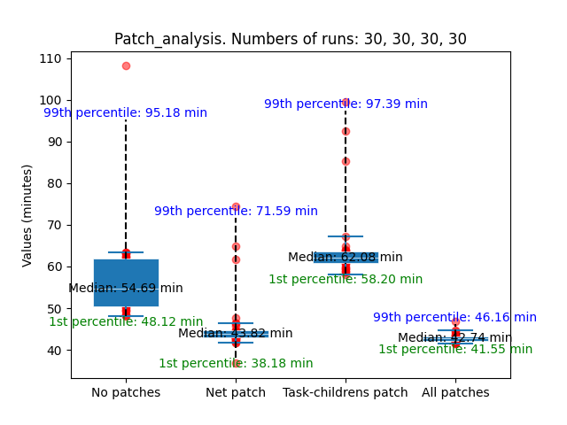

# box_plot.py
Python script for plotting graphs based on the results of the patch experiment (speeding_up)

## Description
The script is designed to build graphs based on the results of the patch experiment (speeding_up). It reads data from text files containing the experiment results and plots the graphs.

## How to run the program?
To configure the program's behavior, a command-line interface is implemented:
```bash
options:
  -h, --help            show this help message and exit
  --file_path_no_pathes FILE_PATH_NO_PATHES
                        Enter the path to the file
  --file_path_net_patch FILE_PATH_NET_PATCH
                        Enter the path to the file
  --file_path_childrens_patch FILE_PATH_CHILDRENS_PATCH
                        Enter the path to the file
  --file_path_all_patches FILE_PATH_ALL_PATCHES
                        Enter the path to the file
  --plot_name PLOT_NAME
                        Enter title of plot
  --save, --no-save     Save the plot (default: True)
  --show, --no-show     Show the plot (default: True)
  --standard_boxplot, --no-standard_boxplot
                      Use standard box plot (default: False)
```

### Arguments
- `file_path_no_pathes`, `file_path_net_patch`, `file_path_childrens_patch`, `file_path_all_patches`: arguments to specify paths to text files — results of the build experiment for `core-image-minimal` without patches, with the network load balancing patch, with the task priority patch, and with both patches respectively. By default, the script expects files `time1.txt`, `time2.txt`, `time3.txt`, `time4.txt` to be located in the subdirectory `speeding_up_results` relative to the script location.
- `plot_name`: the name used as the plot title and for saving the plot as a PNG file. Defaults to `Patch_analysis`.
- `save` and `show`: values to configure the program's behavior — whether to show or not show, save or not save the resulting plots. By default, the plot is both shown and saved.
- `standard_boxplot`: a flag to disable all customizations, leaving only the standard `boxplot` and plotting the values as red dots.

## How to read the graphs?
- The y-axis shows the experiment execution time (in minutes).
- The x-axis shows which experiment was conducted (without patches, with the network load balancing patch, with the task priority patch, and with both patches).

### Legend
- **Blue "boxes"** represent values between the 25th and 75th percentiles.
- **Blue horizontal lines ("whiskers")** represent values within 1.5 interquartile range from the quartiles. These lines end with blue caps.
- **Black dashed lines** represent the 1st and 99th percentiles.
- **Red dots** indicate values in the ranges [1st percentile, 25th percentile] and [75th percentile, 99th percentile].
- Inside the blue box, the median value is labeled in black.
- The 1st and 99th percentiles are labeled in green and blue text respectively.

## How to get the data?
It is necessary to run the `speeding_up_experiment` (src/common/scripts/speeding_up_experiment.sh) with different patch sets. It is recommended to specify the number of repetitions greater than 10 (in the current version we specify 30).

The experiment saves the build results and elapsed time in the folder `src/buildstats_saves`. There is a file time.txt used for plotting the graphs.

## Script output results

### Result with the --standard_boxplot flag


### Result without the --standard_boxplot flag


