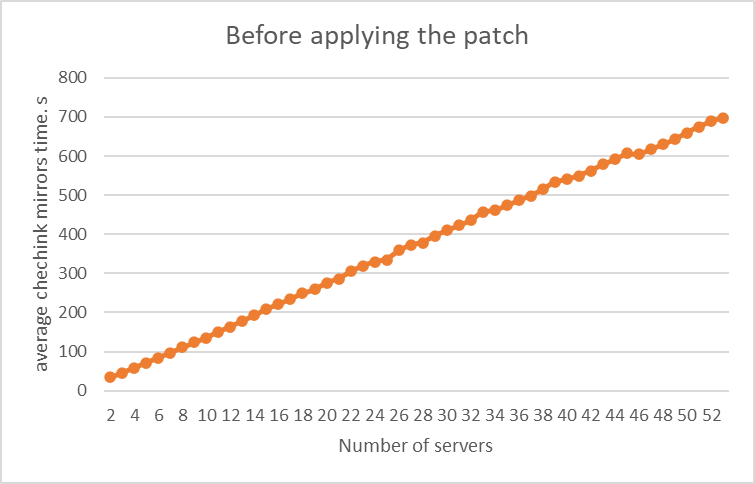
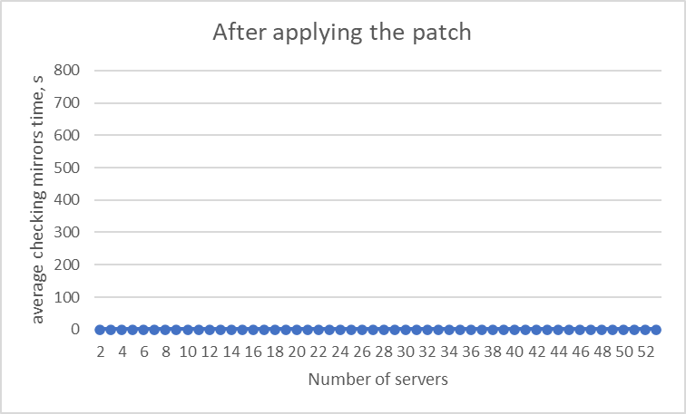
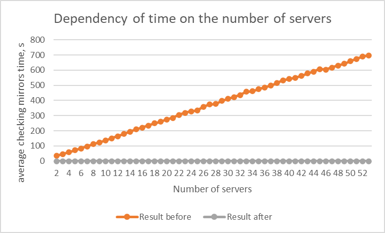
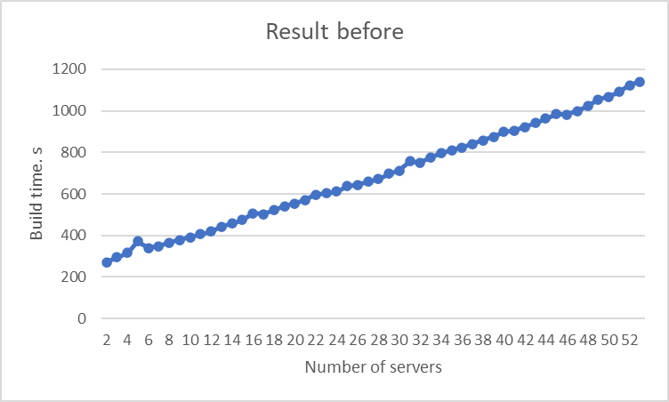
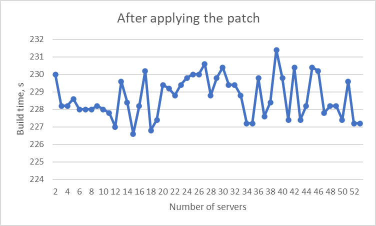
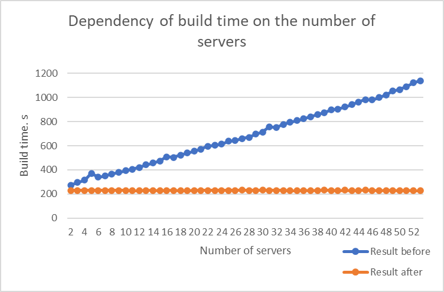

# Description of the Results from the Optimized Mirror Verification Patch Experiment

### Experiment Setup

The experiment was conducted as follows:
1. N working cache servers (mirrors) are launched on remote PCs.
2. A valid index file is created on each cache server.
3. A hash server is launched on the target build PC.
4. The build is iteratively run on the target PC using configurations from the patch.
5. Total build time and signature verification time are measured.

### Description of Collected Data

The data is formatted as:
```
<servers_num>_<hash equivalence time>
```
Data **before** applying the patch:
```
2_34,0
3_45,8
4_58,2
5_71,6
6_83,8
7_97,0
8_111,0
9_124,0
10_135,4
11_151,0
12_164,0
13_178,8
14_193,4
15_208,8
16_221,2
17_235,2
18_248,8
19_259,0
20_275,4
21_285,6
22_305,2
23_319,2
24_329,2
25_334,2
26_359,2
27_373,2
28_377,6
29_396,6
30_410,2
31_422,4
32_435,8
33_457,8
34_461,8
35_474,6
36_486,8
37_498,8
38_515,0
39_533,8
40_541,2
41_549,6
42_561,8
43_579,2
44_591,2
45_607,0
46_604,2
47_617,6
48_630,4
49_642,4
50_659,2
51_675,0
52_689,4
53_697,4
```


Data **after** applying the patch:
```
2_0
3_0
4_0
5_0
6_0
7_0
8_0
9_0
10_0
11_0
12_0
13_0
14_0
15_0
16_0
17_0
18_0
19_0
20_0
21_0
22_0
23_0
24_0
25_0
26_0
27_0
28_0
29_0
30_0
31_0
32_0
33_0
34_0
35_0
36_0
37_0
38_0
39_0
40_0
41_0
42_0
43_0
44_0
45_0
46_0
47_0
48_0
49_0
50_0
51_0
52_0
53_0
```


*Note on post-patch data: Results are zero because signature verification takes ~0 seconds (much less than 1 second) and is unaffected by the number of cache servers.

Result files: [result_before.txt](./source_results/result_before.txt) and [result_after.txt](./source_results/result_after.txt)

We also provide data on **total build time** depending on the number of cache servers:  
Format:
```
<servers_num>_<build time>
```
(Build time here refers to builds using a fully populated cache.)

Data **before** applying the patch:
```
2_272,2
3_295,6
4_315,2
5_371,2
6_340,0
7_349,2
8_365,2
9_377,4
10_392,0
11_406,0
12_419,0
13_441,8
14_457,6
15_473,8
16_507,6
17_503,4
18_522,2
19_540,6
20_554,2
21_571,4
22_595,8
23_603,0
24_612,4
25_636,8
26_643,8
27_659,8
28_670,8
29_697,2
30_712,8
31_757,0
32_751,4
33_776,4
34_795,2
35_810,2
36_822,8
37_841,8
38_857,0
39_875,2
40_898,4
41_904,4
42_921,4
43_941,8
44_963,8
45_983,4
46_981,6
47_999,6
48_1022,4
49_1054,4
50_1067,0
51_1091,4
52_1122,8
53_1139,6
```


Data **after** applying the patch:
```
2_230,0
3_228,2
4_228,2
5_228,6
6_228,0
7_228,0
8_228,0
9_228,2
10_228,0
11_227,8
12_227,0
13_229,6
14_228,4
15_226,6
16_228,2
17_230,2
18_226,8
19_227,4
20_229,4
21_229,2
22_228,8
23_229,4
24_229,8
25_230,0
26_230,0
27_230,6
28_228,8
29_229,8
30_230,4
31_229,4
32_229,4
33_228,8
34_227,2
35_227,2
36_229,8
37_227,6
38_228,4
39_231,4
40_229,8
41_227,4
42_230,4
43_227,4
44_228,2
45_230,4
46_230,2
47_227,8
48_228,2
49_228,2
50_227,4
51_229,6
52_227,2
53_227,2
```

Result files: [build_time_before.txt](./source_results/build_time_before.txt) and [build_time_after.txt](./source_results/build_time_after.txt)

### Graph Descriptions

Signature verification time vs number of cache servers **before** patch:  


Signature verification time vs number of cache servers **after** patch:  


Combined graph of signature verification time before and after patch:  


Build time vs number of cache servers **before** patch:  


Build time vs number of cache servers **after** patch:  


Combined graph of build time before and after patch:  


### Conclusions

1. As shown in the data and graphs, **before** the patch, signature verification time increased with the number of servers. This was due to the growing number of requests sent from the build PC to the mirrors, as each task was being searched for on each mirror. **After** the patch, signature verification time is no longer dependent on the number of cache servers and drops to near-zero values. With a valid index file, only one request is needed to verify a mirror.

2. Total build time also became independent of the number of cache servers, since signature verification no longer scales with server count, and the remaining parts of the build are performed the same way locally on the build PC.
