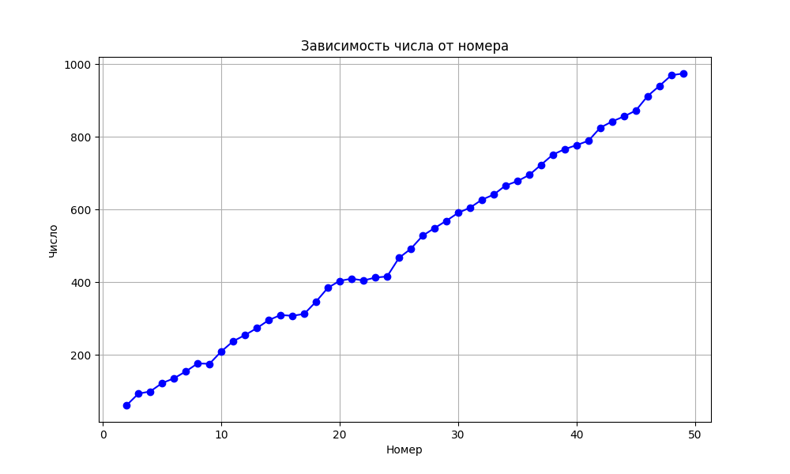
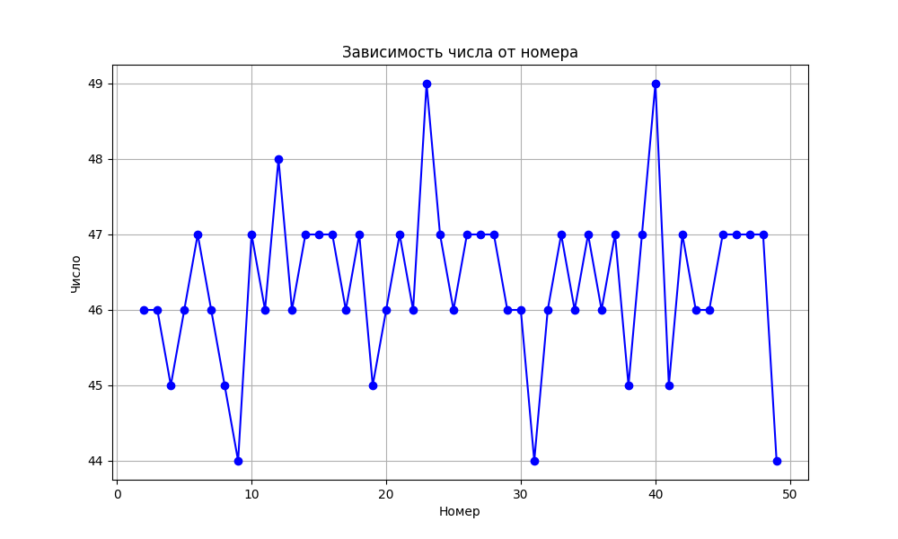

# Описание результатов эксперимента фильтрации патча фильтрации нераочих серверов

### Описание постановки эксперимента
Эксперимент ставился следующим образом:
1. На удаленно ПК поднимается работающий кэш сервер
2. На ПК целевой сборки поднимается работаеющий хэш сервер
3. На ПК целевой сборки создаются конфигурационные файлы, в которых включаются данные о серверах из первых двух пунктов + дописываются адреса с нерабочими серверами 
4. На ПК целевой сборке итеративно запускаются сборки с применение конфигураций из 3 пункта
5. Измеряется время от начала сборки до окончания сверки сигнатур

Пояснение пункт 5:
После сверки сигнатур сборка проходит одинаковым образом как до патча, так и после его применения. Не измеряется исключительно время сверки сигнатур, поскольку фильрация серверов также занимает некоторое время (однако она не входит в процесс сверки сигнатур, а происходит раньше - на этапе парсинга конфигурационного файла).
Рост времени сборки с нерабочими сервера до применbefore.pngения патча связан с увеличеным временем сверки сигнатур. Потому важно измерять время от начала сборки до окончания сверки сигнатур.

### Описания полученных данных
Данные имеют вид:
```
<Количество серверов>_<время от начала сборки до окончания сверки сигнатур>
```

Данные до применения патча:
```
2_62
3_94
4_100
5_123
6_136
7_155
8_177
9_176
10_210
11_238
12_255
13_274
14_296
15_310
16_308
17_313
18_347
19_385
20_404
21_410
22_405
23_413
24_416
25_467
26_492
27_528
28_549
29_569
30_591
31_605
32_627
33_641
34_666
35_678
36_695
37_723
38_751
39_766
40_777
41_789
42_825
43_842
44_856
45_872
46_912
47_940
48_969
49_974
```

Данные после применения патча:
```
2_46
3_46
4_45
5_46
6_47
7_46
8_45
9_44
10_47
11_46
12_48
13_46
14_47
15_47
16_47
17_46
18_47
19_45
20_46
21_47
22_46
23_49
24_47
25_46
26_47
27_47
28_47
29_46
30_46
31_44
32_46
33_47
34_46
35_47
36_46
37_47
38_45
39_47
40_49
41_45
42_47
43_46
44_46
45_47
46_47
47_47
48_47
49_44
```

Файлы с результатами: [result_before.txt](./result_before.txt) и [result_after.txt](./result_after.txt)

### Описание полученных графиков

График зависимости времени от начала сборки до окончания сверки сигнатур до применения патча:  


График зависимости времени от начала сборки до окончания сверки сигнатур после применения патча:  


### Выводы

Как видно по построенным графикам, в ситуации, когда указаны нерабочие сервера, время от начала сборки до окончания сверки сигнатур растет (при 1 рабочем сервере и 1 нерабочем - 62 секунда; при 1 рабочем сервере и 48 неработающих -- 974 секунды), однако после применения патча фильтрации это же время держится в пределах от 44 и 49 секнудах.
Почему именно такое время `44-49` обяснить можно тем, что фильтрация происходит путем всинхронного установления tcp соединения с указанными серверами. Сейчас выставлено TTL время -- 5 секунд. Потому время на фильтрацию потратиться порядка 5 секунд. После же фильтрации продолжается штатная сборка, но без нерабочих серверов. Поскольку в рамках эксперимента работащий сервер был единственный, то время от начала сборки до конца сверки сигнатур будет составляться из:
1. первых этапов сборки (парсинг рецептов, построение дерева задач...)
2. фильтрации нерабочий серверов -- чуть больше 5 секунд
3. сверка сигнатур на оставшихся рабочих серверах

Колебания в этих данных может быть связано со множеством факторов, таких как скорость соединения, нагрузка на систему.
