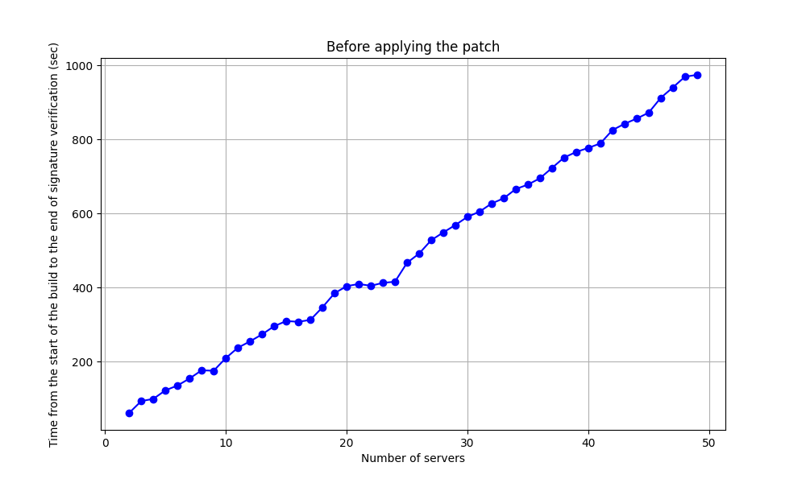
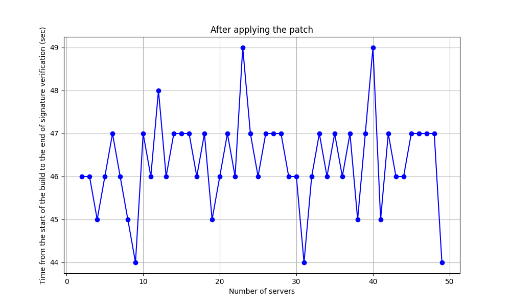

# Description of Results from the Patch Filtering Non-Working Servers

### Experiment Setup

The experiment was conducted as follows:
1. A working cache server is launched on a remote PC.
2. A working hash server is launched on the target build PC.
3. Configuration files are created on the target build PC. These include the servers from steps 1 and 2, plus addresses of non-working servers.
4. Builds are iteratively launched on the target PC using the configurations from step 3.
5. The time is measured from the beginning of the build until the end of the signature verification stage.

Clarification for step 5:  
After signature verification, the build proceeds identically both before and after the patch. The time measured is not strictly signature verification, because filtering also takes time (although it happens earlier — during the configuration parsing stage).  
The increase in build time before the patch, when non-working servers are included, is due to increased signature verification time. That’s why it’s important to measure the time from the beginning of the build until signature verification ends.

### Description of Collected Data

The data format is:
```
<servers_num>_<time from build start to signature verification end>
```

Data **before** applying the patch:
```
2_62
3_94
4_100
5_123
6_136
7_155
8_177
9_176
10_210
11_238
12_255
13_274
14_296
15_310
16_308
17_313
18_347
19_385
20_404
21_410
22_405
23_413
24_416
25_467
26_492
27_528
28_549
29_569
30_591
31_605
32_627
33_641
34_666
35_678
36_695
37_723
38_751
39_766
40_777
41_789
42_825
43_842
44_856
45_872
46_912
47_940
48_969
49_974
```


Data **after** applying the patch:
```
2_46
3_46
4_45
5_46
6_47
7_46
8_45
9_44
10_47
11_46
12_48
13_46
14_47
15_47
16_47
17_46
18_47
19_45
20_46
21_47
22_46
23_49
24_47
25_46
26_47
27_47
28_47
29_46
30_46
31_44
32_46
33_47
34_46
35_47
36_46
37_47
38_45
39_47
40_49
41_45
42_47
43_46
44_46
45_47
46_47
47_47
48_47
49_44
```


Result files: [result_before.txt](./source_results/result_before.txt) and [result_after.txt](./source_results/result_after.txt)

### Description of Graphs

Graph: time from build start to signature verification end **before** the patch:  


Graph: time from build start to signature verification end **after** the patch:  


Combined graph of the above, with logarithmic time scale (Y-axis):  


### Conclusions

As seen from the graphs, when non-working servers are included, the time from build start to signature verification completion increases (e.g., with 1 working and 1 non-working server — 62 seconds; with 1 working and 48 non-working — 974 seconds). However, after applying the filtering patch, this time stays within 44–49 seconds.

The reason this value remains around `44–49` seconds is that filtering is done using asynchronous TCP connection attempts. Currently, the connection TTL is set to 5 seconds. So, about 5 seconds are spent on filtering. After filtering, the regular build process continues — without the non-working servers.

Since only one working server was used in this experiment, the total time from build start to signature verification consists of:
1. Initial build stages (parsing recipes, building task tree, etc.)
2. Filtering out non-working servers — a little over 5 seconds
3. Signature verification on the remaining working server

Variations in this time may be caused by multiple factors such as connection speed or system load.
